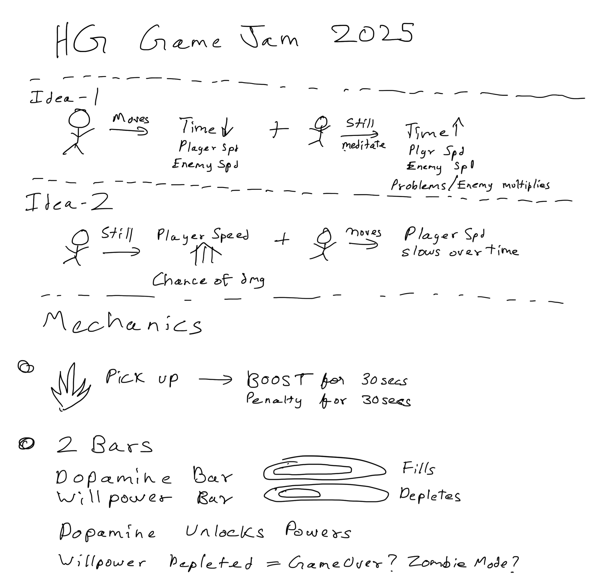

# Untitled ADHD Game

Submission for [HealthyGamer Game Jam 2025](https://itch.io/jam/hg-gj) made in 1 month (mostly 2 weeks).

[Untitled ADHD Game - Play on Itch.io](https://t3snake.itch.io/untitled-adhd-game)


## Theme

Use one or more of the following themes:  

- Time dilation (*Utilized*)
- Project hopping (*Planned but did not make it*)
- Nonlinear thought (*Out of scope*)

## Engine

Godot 4.5 in Compatibility mode (Now migrated to 4.6)

Web Build Hosted

## Assets Used (CC0)

- [Gangster Pixel Characters by Craftpix](https://free-game-assets.itch.io/free-gangster-pixel-character-sprite-sheets-pack)  
- [Oak Woods Tilemap 2D by brullov](https://brullov.itch.io/oak-woods)
- [Tiny Swords (Only for UI) by Pixelfrog](https://pixelfrog-assets.itch.io/tiny-swords) (old version with CC0)  
- [Charter font by Mathew Carter](https://practicaltypography.com/charter.html)  
- [Sounds from Halftone by VOiD1](https://void1gaming.itch.io/halftone-sound-effects-pack-lite)  
- [Footstep Sound from Impact Sounds by Kenney](https://kenney.nl/assets/impact-sounds)  

### Asset used but not included in repo

- [Synthpop by MikaidenJProjects](https://www.mikaidenjprojects.com/free) (different free music every week)

<!-- markdownlint-disable MD040 -->
```
Note: to run this project with BG Music,  
Music needs to be added to Scenes/bg_music_player.tscn  
Since redistribution of music of MikaidenJProjects is not allowed  
```

### Not used anymore

- [3D Leap Land by Essssam](https://essssam.itch.io/3d-leap-land)  
- [Mini Characters by Kenney](https://kenney.nl/assets/mini-characters-1) (Unused but present)  

## Ideas


